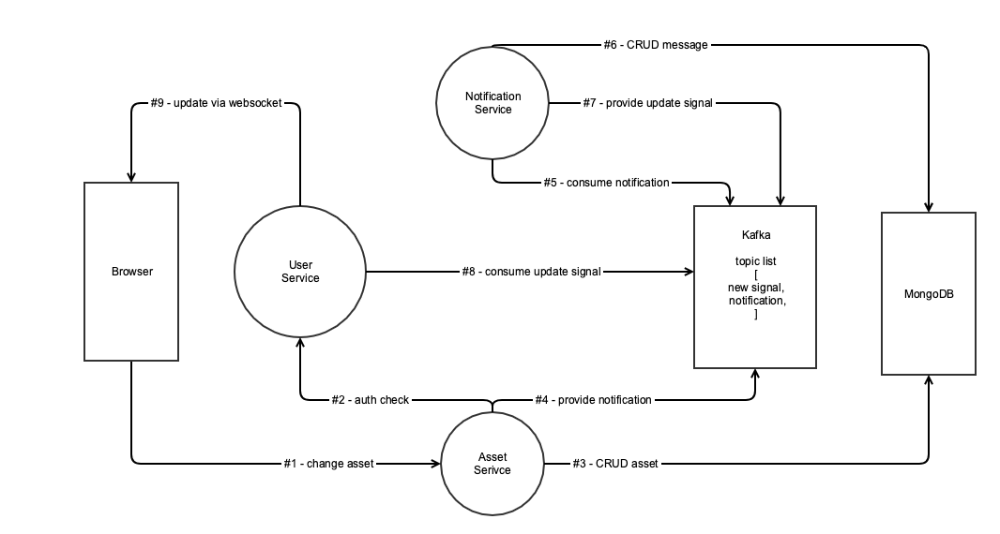

# Empty-Video Microservices
## 1. APIs
### user-service
- POST(/auth/login): for user to sign in, and return their public user info
- GET(/auth/user): for other services to check bearer token, and returns public user info
- GET(/auth/active/{sessionID}): for new user to activated their account via e-mail 
- GET(/api/user/{id}): for other services and user to get public info, return public user info
- POST(/api/user): for new user to register a new account, send email to the account with the activated link.
- PATCH(/api/user): for other services and user to change their profile or system info.
- ...
### asset-service
- GET(/api/comment/{id})
- GET(/api/comment/video/{id})
- PATCH(/api/commment/{id}/like)
- POST(/api/comment")
- DELETE(/api/comment/{id})
- ...
### notification-service
- GET(/api/notification/{userId})
- ...
## 2. Deploy
### how to start this service
1. install docker, maven
2. run docker containers (includes mongodb & admin-mongo & zookeeper & kafka)   
If your are using docker toolbox (old docker version) and you want to use `localhost` instead of the `$(docker-machine ip)`, you also need to do the port mapping. click this link to learn  
[How to Forward Ports to a Virtual Machine](https://www.howtogeek.com/122641/how-to-forward-ports-to-a-virtual-machine-and-use-it-as-a-server/)
```bash
docker-compose up -d
```
3. start all three micro-services manully (will be included in docker-compose later)  
[empty-video-asset-service](https://github.com/naglfari/empty-video-asset-service.git)  
[empty-video-user-service](https://github.com/naglfari/empty-video-user-service.git)  
[empty-video-notification-service](https://github.com/naglfari/empty-video-notification-service.git)  
```
mvn spring-boot:run
```
### how to setup mongodDB dashbaord
- for WinOS(old version docker only), first check the default machine IP address, open browser enter `http://docker-machine-ip:8082/`, don't forget to change application.yml file as well.
- for other os(macos/linux), open browser enter `http://localhost:8082/`
- fill in MongoDB Connections form  
    
connName | conStr | connOpt
--- | --- | ---
(whatever) | mongodb://mongo:27017 | {}

## 3. service details
### notification serivces diagram



1. POST(/api/asset): browser → asset service (handle http reqeust)
2. GET(/api/auth): asset service → user service (send http requests)
3. save asset to mongodb: asset service → MongoDB (sql operation)
4. send this operation to Kafka: asset service → Kafka (produce message)
5. receive this operation from kafka: notification service → Kafka (consume message)
6. save notification to monodb: notification service → MongoDB (sql operation)
7. send this update info to kafka: notification service → Kafka (produce message)
8. receive this update from kafka: user service → kafka (consume message)
9. learning websoket now...
## Developing by Bill Tong  ╮(￣▽￣)╭ 
