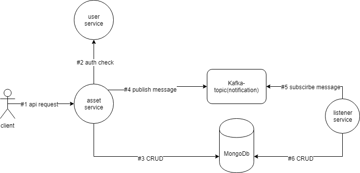

# empty-video-microserivces
## 1. APIs
### user-service [8001:]
- GET(/api/user/{id})
- POST(/api/user)
- PATCH(/api/user)
- POST(/auth/login)
- GET(/auth/user)
- GET(/auth/active/{sessionID})
### comment-service [8002:]
- GET(/api/comment/{id})
- GET(/api/comment/video/{id})
- PATCH(/api/commment/{id}/like)
- POST(/api/comment")
- DELETE(/api/comment/{id})
### dan-service [8003:]
- GET(/api/dan/{videoId})
- POST(/api/dan)
### video-service [8004:]
- GET(/api/video/{id})
- GET(/api/video/random)
- GET(/api/video/search)
- PATCH(/api/video/{id})
- POST(/api/video)
### fav-list-servic[8005:]
- GET(/api/favlist)
- GET(/api/favlist/{id})
- GET(/api/favlist/search)
- POST(/api/favlist)
- PATCH(/api/favlist/{id})
- DELETE(/api/favlist/{id})
### tag-service [8006:]
- GET(/api/tag/{name})
- GET(/api/tag/all)
### message-service [8007:]
- ...
### notification-service [8008:]
- GET(/api/notification/{userId})
### history-serivce [8009:]
- ...
### point-service [8010:]
- ...
## empty-video-microService Structure
### about notification，history record and point services.
消息服务，历史记录服务和积分服务都使用了下图的结构。
资源操作请求成功后，该操作会抽象成一个message，结构如下。
```javascript
{
  "userId": "xxx",                  //操作请求用户
  "operation": "create a comment",  //操作描述
  "object": comment                 //操作的资源实例
}
```



### 以下列出全部的资源操作描述，以及相关操作
- activate a user
消息服务: 发给改user  
历史服务: 记录该操作  
积分服务: 初始化分数信息  
- update a user  
消息服务: 发给改user  
历史服务: 记录该操作  
积分服务: 增加分数  
- create a comment  
消息服务: 发给@的人, 没有@的人不做处理  
历史服务: 记录该操作两次，创造的人和被@的人  
积分服务: 增加分数(判断单日上限)  
- like a comment  
消息服务: 发给被喜欢的人  
历史服务: 记录该操作两次，主动方和被动方  
积分服务: 双方增加分数  
- delete a comment   
消息服务: n/a  
历史服务: 记录该操作  
积分服务: n/a  
- like a video  
消息服务: n/a 
历史服务: 记录该操作  
积分服务: 增加分数(判断单日上限)  
- unlike a video  
消息服务: n/a 
历史服务: 记录该操作  
积分服务: 增加分数(判断单日上限)  
- fav a video  
消息服务: n/a 
历史服务: 记录该操作  
积分服务: 增加分数(判断单日上限)  
- send a message  
消息服务: 发给被发送者   
历史服务: n/a  
积分服务: n/a
- get X point  
消息服务: 发给获得积分者   
历史服务: 记录该操作  
积分服务: n/a
### Architecture designed by Bill Tong  
### ╮(￣▽￣)╭ 