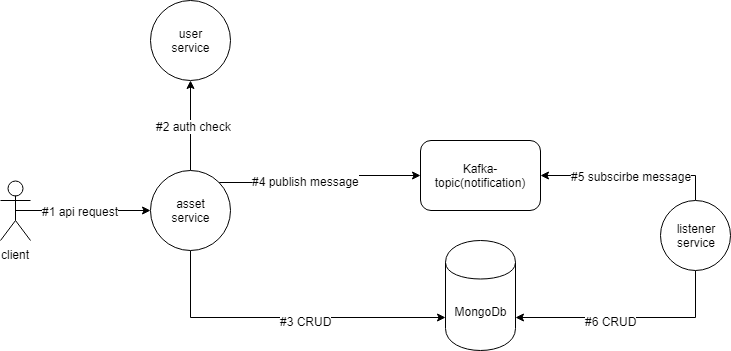
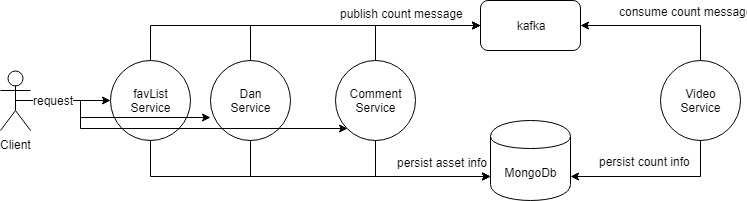
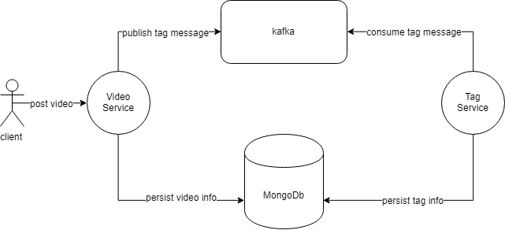

# empty-video-microService Structure
### asset CRUD with the message listerner in services
all the services are using the diagram below.

  

Every Asset Operations are "abstracted" as below json template.
```javascript
{
  "userId": "xxx",                  //操作请求用户
  "operation": "create a comment",  //操作描述
  "object": comment                 //操作的资源实例
}
```
### 视频数据统计(弹幕，评论和收藏数)
在用户进行完comment，dan，favlist服务的添加，或favlist的改变值操作后，需要通过消息队列向video服务发布数据改变的消息，而video会做出相应的改动

### 视频标签统计
在用户进行完video服务的添加或更改操作后，需要把把这个操作通过消息队列发布给tag服务。

### OAuth Service
1. 客户需要先在emptyvideo OAuth平台注册（redirectURI）
2. 向（“/”）请求获得登陆html页面，需要提交验证用户的emptyvideo账号信息
3. 表单提交会转发到POST(/oauth/code)
    1. 先验证客户端信息，成功后获得客户端code,(code里有userId，客户端最好保存它，方便之后再用)
    2. 在验证用户信息，成功获得该用户token
    3. 1，2都正确的话，将code返回到客户端设置到redirect路径
4. 该redirect路径会向GET(/oauth/userInfo)发送请求with code, 返回用户信息